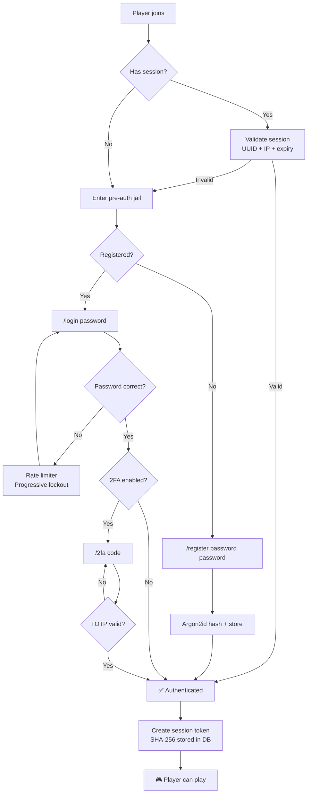

[](https://github.com/architectury/architectury-api)
[](https://fabricmc.net/) [](https://neoforged.net/)
[](https://modrinth.com/mod/vouch) [](https://legacy.curseforge.com/minecraft/mc-mods/vouch) [](https://github.com/valentin-marquez/vouch/releases)

### Vouch

Secure server-side authentication solution for Minecraft featuring Argon2id hashing, 2FA TOTP, and session persistence.
Works on Fabric and NeoForge — no client mod required.

#### Supported Versions

| Minecraft        | Branch     | Status        |
|------------------|------------|---------------|
| 1.21.1           | mc/1.21.1  | ✅ Released    |
| 1.21.2 – 1.21.3 | mc/1.21.2  | ✅ Released     |
| 1.21.4           | mc/1.21.4  | ✅ Released      |
| 1.21.5           | mc/1.21.5  | ⬜ Planned     |
| 1.21.6 – 1.21.8 | mc/1.21.6  | ⬜ Planned     |
| 1.21.9 – 1.21.10| mc/1.21.9  | ⬜ Planned     |
| 1.21.11          | mc/1.21.11 | ⬜ Planned     |


---

#### How it works



#### Features

| | |
|---|---|
| **Auth** | Argon2id hashing · TOTP 2FA with in-game QR codes · Session persistence |
| **Security** | Rate limiting · Pre-auth isolation · Async crypto (zero TPS impact) |
| **Storage** | H2 · SQLite · MySQL · PostgreSQL — with HikariCP pooling |
| **UX** | Titles · BossBar countdown · ActionBar · Configurable sounds |
| **Platform** | Fabric + NeoForge via Architectury · LuckPerms integration |
| **i18n** | `en_us`, `es_mx` built-in · Fully customizable |

#### Architecture

```
common/     Shared code — auth, commands, config, crypto, database, mixins
fabric/     Fabric entrypoint + Fabric Permissions API
neoforge/   NeoForge entrypoint + NeoForge PermissionAPI
```

#### Requirements

- Minecraft 1.21.x · Java 21+
- Fabric (≥0.15.11) + Fabric API, or NeoForge (≥21.1)
- [Architectury API](https://modrinth.com/mod/architectury-api)

---

[](https://ko-fi.com/nozzdev)

License: All Rights Reserved — Source Available (see LICENSE file)
