[](https://github.com/architectury/architectury-api)
[](https://fabricmc.net/) [](https://neoforged.net/)
[](https://modrinth.com/mod/vouch) [](https://legacy.curseforge.com/minecraft/mc-mods/vouch) [](https://github.com/valentin-marquez/vouch/releases)

### Vouch

Secure server-side authentication solution for Minecraft featuring Argon2id hashing, 2FA TOTP, and session persistence.
Works on Fabric and NeoForge — no client mod required.

#### Supported Versions

| Minecraft        | Branch     | Status        |
|------------------|------------|---------------|
| 1.21.1           | mc/1.21.1  | ✅ Released    |
| 1.21.2 – 1.21.3 | mc/1.21.2  | ✅ Released     |
| 1.21.4           | mc/1.21.4  | ✅ Released      |
| 1.21.5           | mc/1.21.5  | ⬜ Planned     |
| 1.21.6 – 1.21.8 | mc/1.21.6  | ⬜ Planned     |
| 1.21.9 – 1.21.10| mc/1.21.9  | ⬜ Planned     |
| 1.21.11          | mc/1.21.11 | ⬜ Planned     |


---

#### How it works

```mermaid
flowchart TD
    A[Player joins] --> B{Has session?}
    B -- Yes --> C[Validate session\nUUID + IP + expiry]
    C -- Valid --> D[✅ Authenticated]
    C -- Invalid --> E[Enter pre-auth jail]
    B -- No --> E

    E --> F{Registered?}
    F -- No --> G["/register password password"]
    F -- Yes --> H["/login password"]

    G --> I[Argon2id hash + store]
    I --> D

    H --> J{Password correct?}
    J -- No --> K[Rate limiter\nProgressive lockout]
    K --> H
    J -- Yes --> L{2FA enabled?}

    L -- No --> D
    L -- Yes --> M["/2fa code"]
    M --> N{TOTP valid?}
    N -- No --> M
    N -- Yes --> D

    D --> O[Create session token\nSHA-256 stored in DB]
    O --> P[🎮 Player can play]
```



#### Features

| | |
|---|---|
| **Auth** | Argon2id hashing · TOTP 2FA with in-game QR codes · Session persistence |
| **Security** | Rate limiting · Pre-auth isolation · Async crypto (zero TPS impact) |
| **Storage** | H2 · SQLite · MySQL · PostgreSQL — with HikariCP pooling |
| **UX** | Titles · BossBar countdown · ActionBar · Configurable sounds |
| **Platform** | Fabric + NeoForge via Architectury · LuckPerms integration |
| **i18n** | `en_us`, `es_mx` built-in · Fully customizable |

#### Architecture

```
common/     Shared code — auth, commands, config, crypto, database, mixins
fabric/     Fabric entrypoint + Fabric Permissions API
neoforge/   NeoForge entrypoint + NeoForge PermissionAPI
```

#### Requirements

- Minecraft 1.21.x · Java 21+
- Fabric (≥0.15.11) + Fabric API, or NeoForge (≥21.1)
- [Architectury API](https://modrinth.com/mod/architectury-api)

---

[](https://ko-fi.com/nozzdev)

License: All Rights Reserved — Source Available (see LICENSE file)
